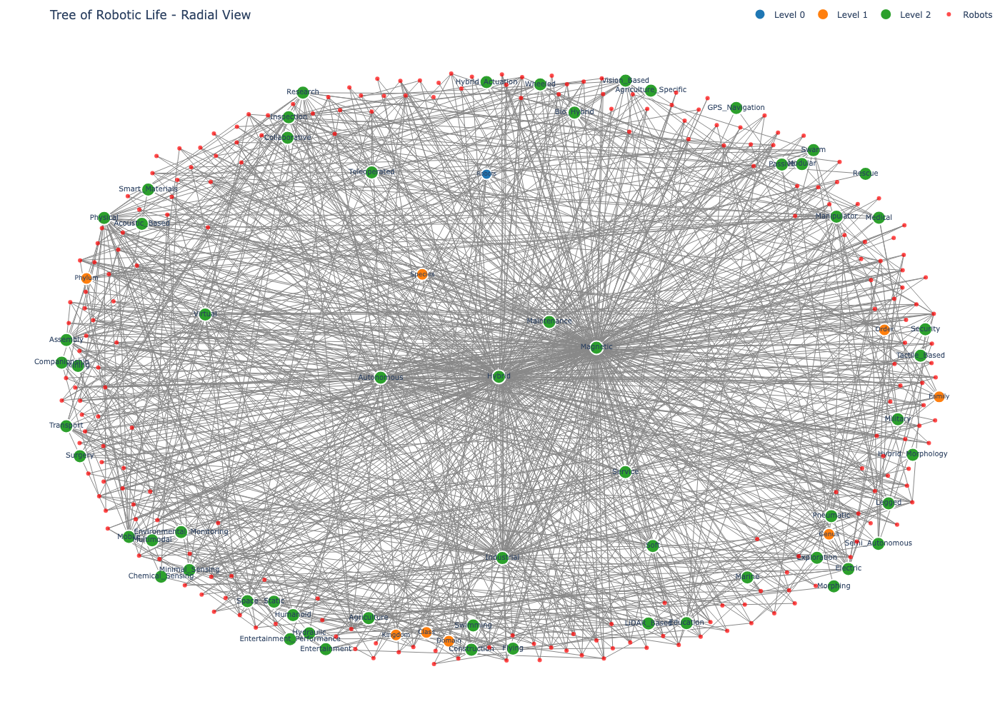
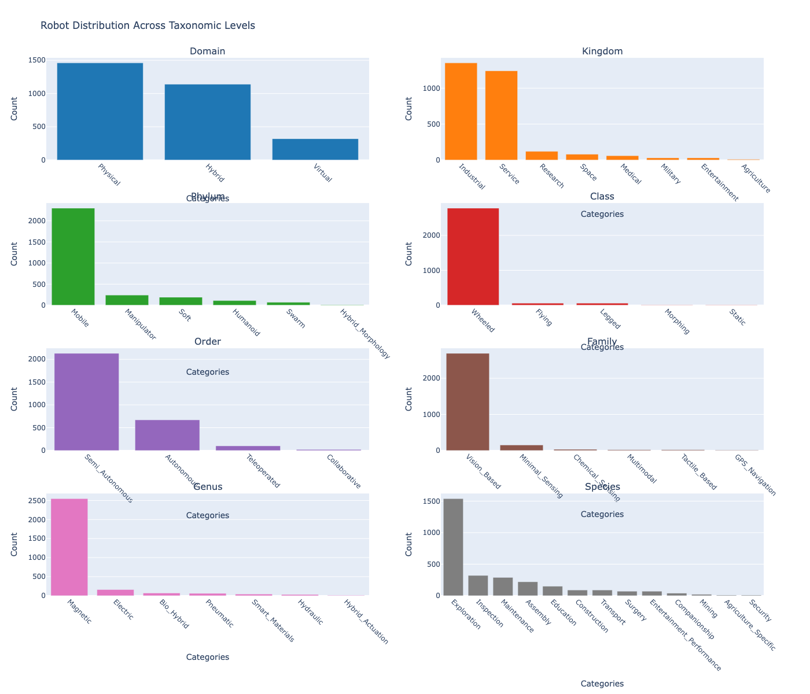
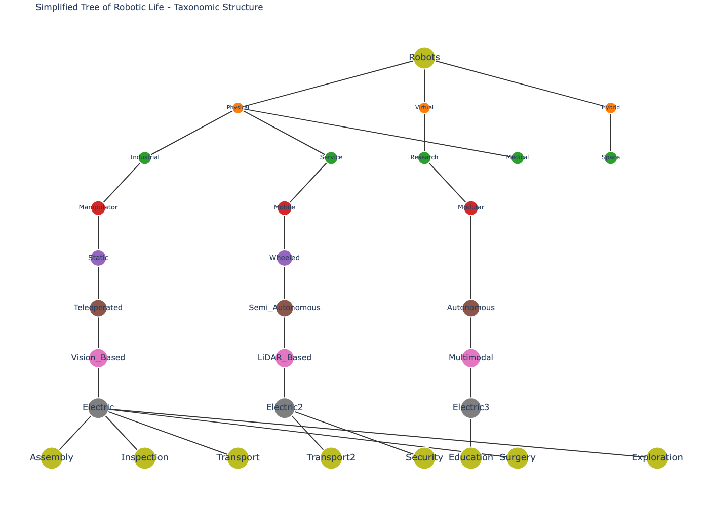
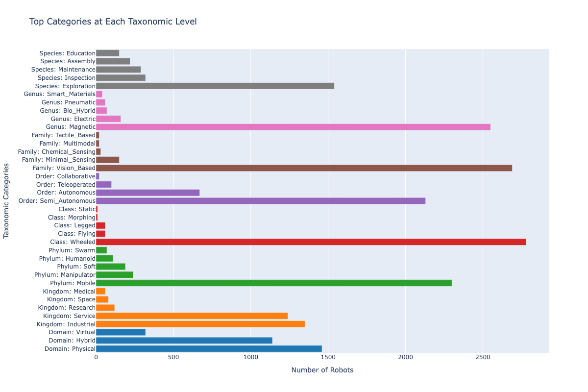

# Robot Taxonomy Agent 🤖

A comprehensive system that discovers, classifies, and visualizes robots using a hierarchical taxonomy inspired by biological classification. This project is part of the research initiative "Re-designing the Tree of Robotic Life" at Frontiers in Robotics and AI.

**Author**: Prof. Adam A. Stokes

## Research Context

This project contributes to the [Frontiers Research Topic: "Re-designing the Tree of Robotic Life"](https://www.frontiersin.org/research-topics/64890/re-designing-the-tree-of-robotic-life), which explores the application of biological taxonomy principles to robotic systems. The goal is to create a comprehensive classification system that reveals evolutionary relationships between different types of robots, similar to the biological tree of life.

## Features

- **🌐 Web Scraping**: Automatically searches Wikipedia and manufacturer websites
- **🏷️ Hierarchical Classification**: 8-level taxonomy (Domain → Kingdom → Phylum → Class → Order → Family → Genus → Species)
- **🌳 Multiple Visualization Types**: 
  - **Tree of Life Visualizations**: Radial, phylogenetic, and hierarchical dendrogram views
  - **Statistical Analysis**: Bar charts showing robot distribution across taxonomic levels
  - **Simplified Trees**: Clean taxonomic structure without individual robot nodes
  - **Summary Charts**: Top categories at each taxonomic level
- **📊 Dashboard**: Interactive web interface for exploring robot taxonomy
- **🤖 Machine Learning**: Clustering to discover natural robot groupings
- **📈 PNG Export**: High-quality static visualizations for research and presentations

## Example Visualizations

Below are examples of the visualizations generated by this project:

| Radial Tree of Life | Taxonomy Bar Charts |
|:-------------------:|:-------------------:|
|  |  |

| Simplified Taxonomic Tree | Top Categories Summary |
|:------------------------:|:----------------------:|
|  |  |

These images show:
- **Radial Tree of Life**: The overall hierarchical structure of robot taxonomy
- **Taxonomy Bar Charts**: Distribution of robots across each taxonomic level
- **Simplified Tree**: Clean, uncluttered view of the taxonomy
- **Summary Chart**: Top categories at each level for quick statistical insight

## Taxonomy Structure

The system uses an 8-level hierarchical taxonomy:

| Level | Description | Examples |
|-------|-------------|----------|
| **Domain** | Operational environment | Physical, Virtual, Hybrid |
| **Kingdom** | Application domain | Industrial, Medical, Research, Military |
| **Phylum** | Morphological structure | Manipulator, Mobile, Humanoid, Soft |
| **Class** | Locomotion mechanism | Static, Wheeled, Legged, Flying |
| **Order** | Autonomy level | Teleoperated, Semi_Autonomous, Autonomous |
| **Family** | Sensing modality | Vision_Based, LiDAR_Based, Tactile_Based |
| **Genus** | Actuation system | Electric, Hydraulic, Pneumatic, Smart_Materials |
| **Species** | Application specialization | Assembly, Surgery, Exploration, Security |

## Quick Start

1. **Install dependencies**:
```bash
pip install -r requirements.txt
```

2. **Run the full pipeline**:
```bash
python src/main.py --mode full
```

3. **Open dashboard**: http://localhost:8050

## Usage

### Full Pipeline (Recommended)
```bash
python src/main.py --mode full
```

### Individual Components
```bash
# Scraping only
python src/main.py --mode scraper

# Classification only (requires scraped data)
python src/main.py --mode classifier

# Visualization only (requires classified data)
python src/main.py --mode visualizer
```

### Custom Search Terms
```bash
python src/main.py --mode scraper --search-terms "space robots" "medical robots"
```

### Static Visualizations
```bash
python src/main.py --mode full --no-dashboard
```

This generates 7 PNG visualizations:
- `robot_radial_tree.png` - Radial tree of life view
- `robot_phylogenetic_tree.png` - Phylogenetic-style tree
- `robot_dendrogram.png` - Hierarchical dendrogram
- `robot_clusters.png` - Machine learning clusters
- `robot_taxonomy_bars.png` - Statistical bar charts
- `robot_simplified_tree.png` - Clean taxonomic structure
- `robot_taxonomy_summary.png` - Top categories summary

## Project Structure

```
robot-taxonomy-agent/
├── src/main.py                    # Main application
├── web_scraper/robot_scraper.py   # Web scraping
├── classifier/robot_classifier.py  # Taxonomy classification
├── visualizer/robot_tree_visualizer.py # Visualization
├── data/                          # Generated data files
├── Robotic taxonomy.md            # Taxonomy definition
└── requirements.txt               # Dependencies
```

## Visualization Types

### Tree of Life Visualizations
- **Radial Tree**: Circular layout similar to biological tree of life
- **Phylogenetic Tree**: Evolutionary-style branching showing robot relationships
- **Hierarchical Dendrogram**: Dendrogram-style layout with clear taxonomic levels

### Statistical Analysis
- **Taxonomy Bar Charts**: 8 subplots showing robot distribution across each taxonomic level
- **Summary Charts**: Horizontal bar charts showing top categories at each level
- **Cluster Analysis**: Machine learning-based robot groupings

### Simplified Views
- **Simplified Tree**: Clean taxonomic structure without individual robot nodes
- **Statistical Overview**: Easy-to-read distributions and percentages
- **Research-Ready**: Perfect for academic presentations and papers

## Dashboard Features

- **Interactive Tree Visualization**: Hierarchical view of robot relationships
- **Multi-level Filtering**: Filter by any of the 8 taxonomic levels
- **Statistics**: Summary of classification results
- **Robot Details**: Click on robots to see detailed information
- **Real-time Analysis**: Dynamic exploration of the robot taxonomy

## Data Sources

- **Wikipedia**: Robot categories and articles
- **Manufacturer Websites**: ABB, FANUC, KUKA, Yaskawa
- **Robot Databases**: Various robot information sources

## Customization

### Modify Taxonomy
Edit `Robotic taxonomy.md` to update the hierarchical structure.

### Add Data Sources
Modify `web_scraper/robot_scraper.py` to add new scraping sources.

### Custom Visualizations
Edit `visualizer/robot_tree_visualizer.py` to modify visual representations.

### Visualization Types
The system supports multiple visualization approaches:
- **Tree of Life**: For evolutionary-style relationships
- **Statistical**: For data analysis and distributions
- **Simplified**: For clean, presentation-ready views
- **Interactive**: For exploration and discovery

## Troubleshooting

### Common Issues

1. **Import Errors**: Install dependencies
   ```bash
   pip install -r requirements.txt
   ```

2. **No Data Found**: Run scraper first
   ```bash
   python src/main.py --mode scraper
   ```

3. **Dashboard Issues**: Use static mode
   ```bash
   python src/main.py --mode full --no-dashboard
   ```

4. **Crowded Visualizations**: Use simplified views
   - `robot_taxonomy_bars.png` - Statistical distributions
   - `robot_simplified_tree.png` - Clean structure
   - `robot_taxonomy_summary.png` - Top categories

## Contributing

1. Fork the repository
2. Create a feature branch
3. Make your changes
4. Submit a pull request

## License

MIT License - see LICENSE file for details.

## Research Applications

This system is designed for research in robotic taxonomy and classification:

- **Academic Presentations**: Use simplified trees and statistical charts
- **Research Papers**: High-quality PNG exports for publication
- **Data Analysis**: Comprehensive statistical breakdowns
- **Comparative Studies**: Multiple visualization types for different perspectives
- **Educational Content**: Clear, understandable visualizations

---

**Happy Robot Exploring! 🤖🌳** 